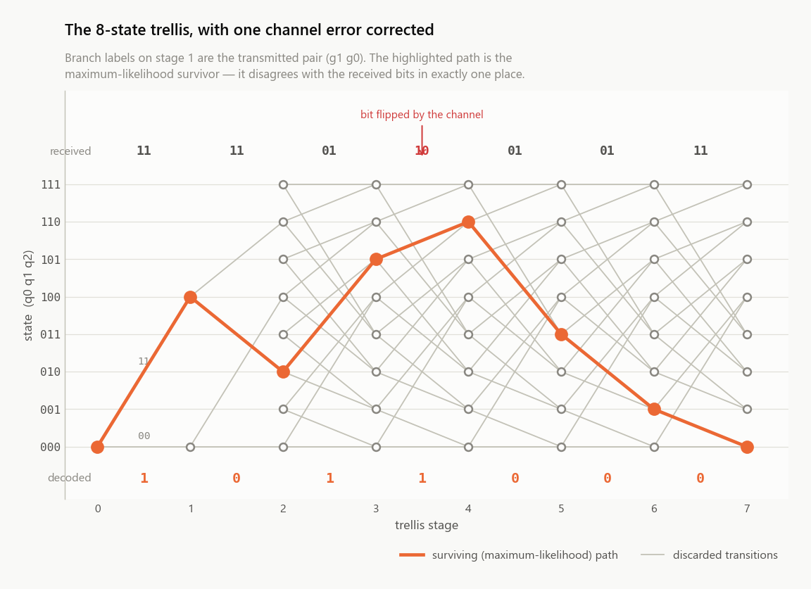
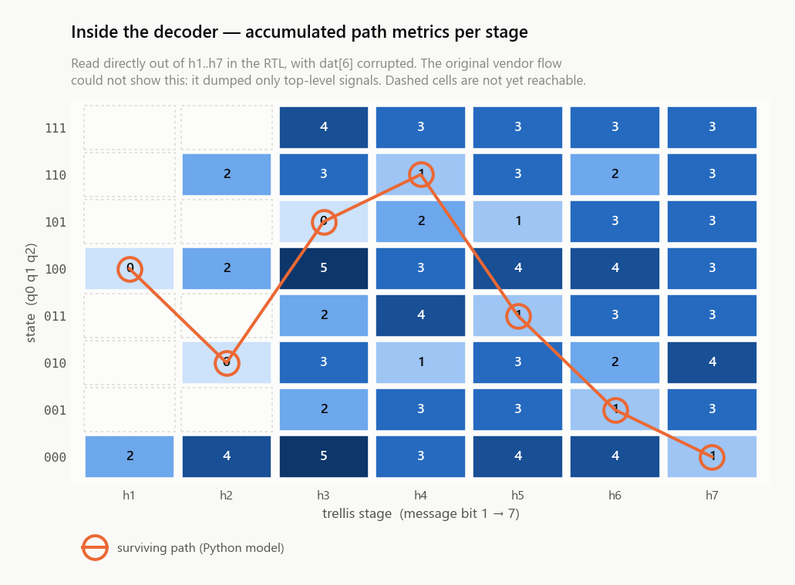
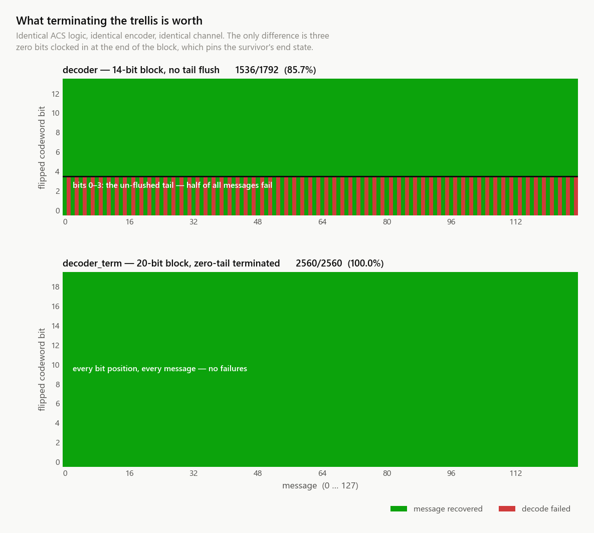
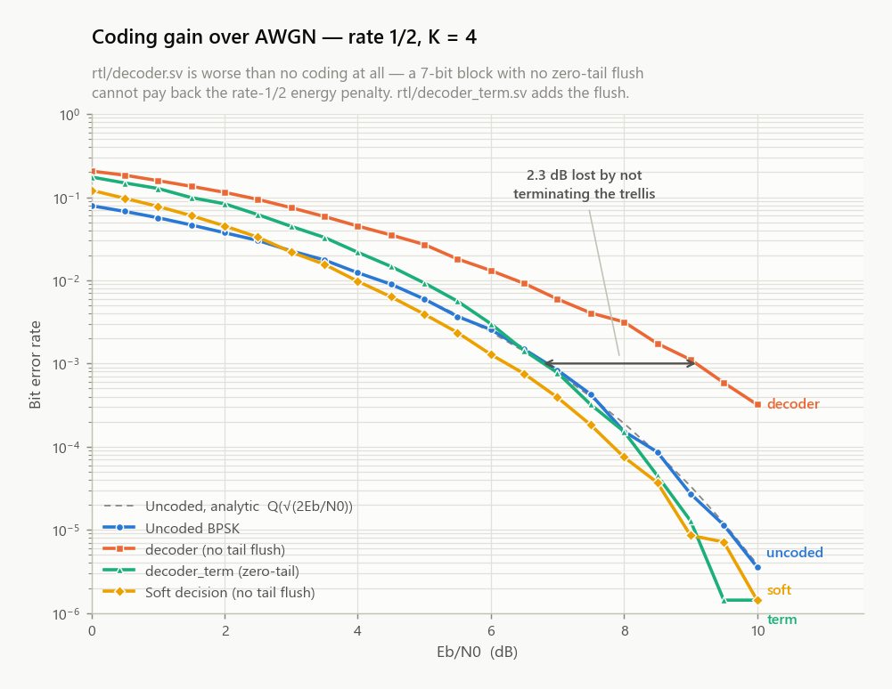
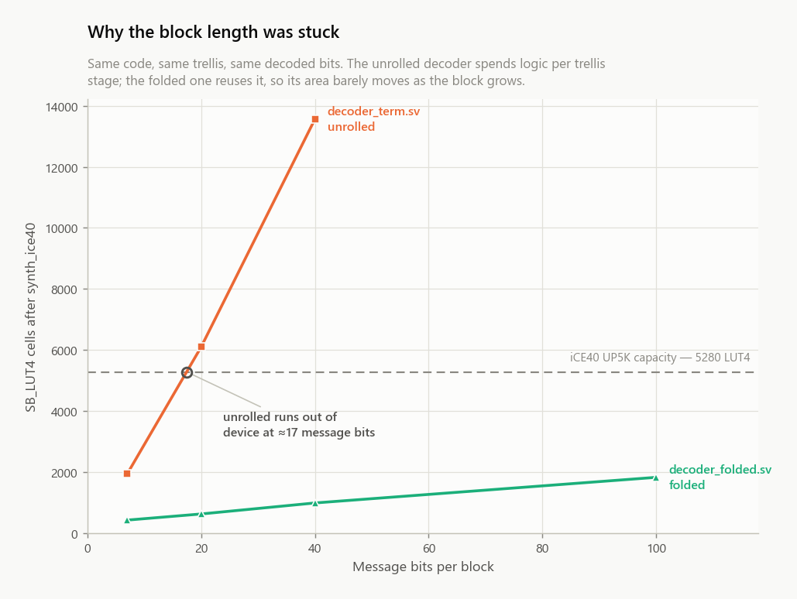

# Viterbi (2, 1, 4) — convolutional encoder and decoder in SystemVerilog

A rate-1/2, constraint-length-4 convolutional encoder and a hard-decision
Viterbi decoder in SystemVerilog, simulated, verified, synthesised and plotted
with an entirely open-source toolchain.

<p align="center">
  <picture>
    <source media="(prefers-color-scheme: dark)" srcset="docs/img/trellis-dark.png">
    
  </picture>
</p>

| | |
|---|---|
| Rate | 1/2 |
| Constraint length K | 4 (3 memory elements, 8 states) |
| Generators | g1 = `1111` (17₈), g0 = `1011` (13₈) |
| Decision | hard |

---

## Quickstart

You need **Docker** and **Python 3.10+**.

```bash
git clone https://github.com/rvxfahim/viterbi-2-1-4
cd viterbi-2-1-4
pip install numpy matplotlib vcdvcd

python scripts/run_all.py env      # what's available
python scripts/run_all.py all      # simulate, verify, sweep, plot
```

`all` writes every figure into `docs/img/` and every dataset into `results/`.
Individual stages:

```bash
python scripts/run_all.py gen      # regenerate the RTL from its Jinja template
python scripts/run_all.py model    # Python golden model self-test
python scripts/run_all.py cpp      # C++ reference model vs the golden model
python scripts/run_all.py sim      # RTL simulation + self-checking benches
python scripts/run_all.py sweep    # exhaustive correctness sweeps
python scripts/run_all.py long     # generated RTL at 20 and 40 message bits
python scripts/run_all.py folded   # folded RTL at 20/40/100 bits, and its BER
python scripts/run_all.py ber      # Monte-Carlo BER study
python scripts/run_all.py synth    # Yosys + nextpnr   (needs OSS CAD Suite)
python scripts/run_all.py plots    # regenerate all figures
```

Synthesis additionally needs the
[OSS CAD Suite](https://github.com/YosysHQ/oss-cad-suite-build/releases/latest)
installed to a path with no spaces; the script finds it automatically.

---

## Where things are

```
rtl/
  d_ff.sv                                      the encoder
  decoder.sv  decoder_term.sv                  GENERATED -- do not edit
  decoder_folded.sv                            folded, hand-written, any length
  gen/decoder.sv.j2                            the template they come from
  legacy/decoder.sv                            the 2022 hand-written decoder
tb/
  decoder_bench.sv                             self-checking, plusarg-driven
  encoder_bench.sv                             all 128 messages -> CSV
  system_tb.sv                                 end-to-end 1920-case sweep
  system_term_tb.sv                            terminated, 2688-case sweep
  system_folded_tb.sv                          folded, 2688 + 512 3-error cases
  decoder_gen_tb.sv                            any block length, -GMSG_BITS=N
  decoder_folded_gen_tb.sv                     folded, any length, over a BSC
  legacy/                                      the 2022 testbenches, verbatim
model/
  viterbi_ref.py                               bit-accurate golden model
  ber_sweep.py                                 vectorised Monte-Carlo BER
  cpp/                                         C++ reference model, file-driven
scripts/
  run_all.py                                   the only entry point you need
  gen_rtl.py                                   renders the RTL from the template
  vl.py                                        Verilator-in-Docker driver
  synth.py                                     Yosys + nextpnr + netlistsvg
  check_rtl.py  check_cpp.py                   RTL / C++ vs model equivalence
  check_long.py                                generated RTL at 20 / 40 bits
  check_folded.py                              folded RTL at 20/40/100 + its BER
  plot_waves.py, plot_ber.py, plot_trellis.py  figures
  plot_area.py                                 area against block length
  vizstyle.py                                  shared light/dark plot theme
docs/
  architecture.md  bitorder.md                 how it works
  known-issues.md  toolchain.md                what to watch out for
  img/                                         generated figures
  legacy/                                      original PDFs, slides, truth table
results/            vcd/  synth/  ber/         generated data
```

---

## The encoder

Four-tap shift register; the two parities are taken from the post-shift
register. With the pre-shift state written `s = (q0, q1, q2)`:

```
out1 = d ^ s2 ^ s1 ^ s0        // g1 = 1111
out0 = d ^ s2 ^ s0             // g0 = 1011
next = (d << 2) | (s >> 1)
```

<p align="center">
  
</p>

`rtl/d_ff.sv` is the same file in every flow below.

---

## The decoder, and why there are two of them

### The transliterated design

The original decoder (`rtl/decoder.sv`, and its zero-tail-terminated sibling
`rtl/decoder_term.sv`) was written by porting the C++ reference model
structure for structure. That model keeps one `HammingTable` object per trellis
stage and walks the eight states of each with a switch over cases `a..h`. In
SystemVerilog that became:

* one register bank per trellis stage — `h1..h7` — so the whole trellis sits on
  the die at once;
* the switch over states became a sequencer, one add-compare-select per clock.

That is valid, working hardware — it is exhaustively verified against the
Python model — but it is unrolled in space *and* serialised in time, so it pays
the area of a parallel design and the throughput of a serial one. It costs
about **350 LUT4 per trellis stage**, which means the block length is capped by
the FPGA: an iCE40 UP5K runs out at roughly 17 message bits.

The RTL is generated from `rtl/gen/decoder.sv.j2` by `scripts/gen_rtl.py`,
because writing out seven stages by hand took 1317 lines and ten stages would
have taken ~600 more of near-identical ladder logic. Edit the template, not the
`.sv` files; `run_all.py gen --check` fails if they have drifted.

### The hardware-friendly design

`rtl/decoder_folded.sv` decodes the same trellis and returns the same bits from
a different architecture. In hardware, a software loop over an array splits
into time (the loop) and space (the array), and the designer chooses the trade.
The folded decoder chooses:

* **the loop → reuse over time.** One set of eight add-compare-select units,
  all eight evaluated in parallel, retiring one trellis stage per clock. That
  is `STAGES` clocks instead of `8 × STAGES`.
* **the array → memory.** Eight path-metric registers that are reused rather
  than replicated, plus one byte of survivor decisions per stage.

The path metrics are renormalised each stage by subtracting the stage minimum,
which keeps them 4 bits wide no matter how long the block is. Everything except
the survivor memory and the parallel input register is therefore constant in
block length — and both of those are memory, not logic.

It is hand-written rather than generated, because the whole point is that it
needs no per-stage code at all. At 7 message bits it is held to the same 2688
exhaustive cases as `decoder_term`, plus 512 random three-error words, and
agrees with the golden model on all 3200. `tb/decoder_folded_gen_tb.sv` takes
`MSG_BITS` as a parameter and carries that agreement out to 20, 40 and 100
message bits — the same RTL, no re-render, since there is no per-stage code to
re-render.

Full detail — tie-breaking rules, the cycle schedule, the critical path — is in
**[docs/architecture.md](docs/architecture.md)**. Before wiring anything up,
read **[docs/bitorder.md](docs/bitorder.md)**.

---

## Results

### The original decoder, from the inside

Path metric of every state at every trellis stage, read straight out of the
RTL's VCD, with the surviving path from the Python model overlaid. This is the
Viterbi algorithm itself: eight running metrics, one survivor per state per
stage, and the traceback that reads them back.

<p align="center">
  <picture>
    <source media="(prefers-color-scheme: dark)" srcset="docs/img/decoder_metrics-dark.png">
    
  </picture>
</p>

Terminating the block with `K-1 = 3` zero bits pins the survivor's end state at
`000`, so traceback starts there instead of searching all eight states. That
takes single-bit error correction from 1536/1792 (85.7%) to 2560/2560 (100%),
and is worth 2.3 dB.

<p align="center">
  <picture>
    <source media="(prefers-color-scheme: dark)" srcset="docs/img/error_correction_compare-dark.png">
    
  </picture>
</p>

### Error rate

<p align="center">
  <picture>
    <source media="(prefers-color-scheme: dark)" srcset="docs/img/ber_awgn-dark.png">
    
  </picture>
</p>

Against uncoded BPSK the terminated decoder wins by only +0.2 dB at BER = 1e-4,
which is the textbook result for this configuration: three tail bits on a 7-bit
block drop the effective rate to 0.35, and `10 log10(0.35 · 6 / 2)` = +0.21 dB.
The tail is 3 bits however long the block is, so a longer block gets most of the
code's gain back — +1.54 dB at 100 message bits. The RTL is hard-decision only;
soft decision would be worth about 3.2 dB more.

Those curves come from `model/ber_sweep.py`. The folded decoder is what makes
the long block fit on a device, so the long-block end of them is also measured
on the RTL itself, by `tb/decoder_folded_gen_tb.sv`. Hard-decision BPSK over
AWGN *is* a binary symmetric channel with `p = Q(√(2·R·Eb/N0))`, so the bench
runs a BSC at exactly the crossover each Eb/N0 implies:

| Eb/N0 | 7 bits, RTL | 100 bits, RTL | 100 bits, model | uncoded |
|---|---|---|---|---|
| 4 dB | 2.29e-2 | 1.15e-2 | 1.18e-2 | 1.25e-2 |
| 5 dB | 9.01e-3 | 2.87e-3 | 2.83e-3 | 5.95e-3 |
| 6 dB | 2.48e-3 | 5.48e-4 | 5.65e-4 | 2.39e-3 |
| 7 dB | 6.86e-4 | 5.35e-5 | 7.03e-5 | 7.73e-4 |

2 million decoded message bits per 100-bit point, on the real decoder. The
7-bit column is still losing to uncoded until about 6.4 dB; the 100-bit column
is a factor of 14 better than uncoded by 7 dB, which is the ~1.5 dB of gain the
model predicts, now measured through the RTL rather than around it.

### The folded decoder scales

<p align="center">
  <picture>
    <source media="(prefers-color-scheme: dark)" srcset="docs/img/area_blocklen-dark.png">
    
  </picture>
</p>

~350 LUT4 per trellis stage against ~15. The transliterated decoder's area
grows with the block length until it does not fit; the folded one barely moves.

| message bits | unrolled LUT4 | folded LUT4 |
|---|---|---|
| 7 | 1936 | 421 |
| 20 | 6098 — over device | 622 |
| 40 | 13565 — over device | 983 |
| 100 | — | 1823 |

### Synthesis

Yosys 0.67 `read_slang` plus nextpnr-ice40, targeting a Lattice iCE40 UP5K in
SG48, on the canonical 7-bit block:

| | `decoder` | `decoder_term` | `decoder_folded` |
|---|---|---|---|
| Logic cells | 1810 / 5280 (34%) | 2356 / 5280 (44%) | **627 / 5280 (11%)** |
| LUT4 / carry / flops | 1338 / 511 / 497 | 1936 / 799 / 703 | 421 / 142 / 210 |
| Fmax | ~13 MHz | ~27 MHz | ~11 MHz |
| Clocks per block | 53 | 80 | **20** |
| Throughput | 1.70 Mbit/s | 2.37 Mbit/s | **3.95 Mbit/s** |

The folded decoder is 3.8× smaller and 1.7× faster in throughput despite the
lowest clock of the three, because it needs a quarter of the clocks for the
same trellis. Its low Fmax is its own weak point: a whole stage — eight
butterflies, the eight-way minimum, the normalising subtract — sits in one
combinational path, which pipelining would shorten.

### Correctness

Every decoder is driven end to end from the encoder for **every message × every
single-bit error position**, and every case is cross-checked against the
independent Python model.

```
decoder      -- 128 messages x 15 channels  (14-bit, unterminated)
    SUMMARY  clean channel  : 128/128
    SUMMARY  1-bit errors   : 1536/1792 (85.7%)
decoder_term -- 128 messages x 21 channels  (20-bit, terminated)
    SUMMARY  clean channel  : 128/128
    SUMMARY  1-bit errors   : 2560/2560 (100.0%)

PASS  encoder: all 128 RTL codewords match model/viterbi_ref.encode()
PASS  decoder: RTL and model agree on all 1920 decode cases
PASS  decoder_term: RTL and model agree on all 2688 decode cases
PASS  decoder_folded: RTL and model agree on all 3200 decode cases

PASS  folded, 20 message bits  (23 stages,  46 clocks): all 200 frames
PASS  folded, 40 message bits  (43 stages,  86 clocks): all 200 frames
PASS  folded, 100 message bits (103 stages, 206 clocks): all 200 frames
```

Known defects found and fixed along the way are written up in
**[docs/known-issues.md](docs/known-issues.md)**. `rtl/legacy/` and `tb/legacy/`
keep the 2022 hand-written decoder and its testbenches verbatim, so the
generated version can be diffed against them.

---

## Why these tools

The decoder is built on **unpacked** structs containing unpacked arrays. They
cannot be made `packed`, and that single fact decides the toolchain: Verilator
and Yosys' slang front end handle them, while Icarus Verilog and Yosys'
built-in Verilog reader reject them outright. Verilator has no working
native-Windows build, so it runs in a pinned container.

Exact command lines and the version matrix are in
**[docs/toolchain.md](docs/toolchain.md)**.

---

## Credits and licence

Original design, C++ reference model and presentation by
[@rvxfahim](https://github.com/rvxfahim). Licensed under **GPL-3.0** — see
[LICENSE](LICENSE).

References:

* A. J. Viterbi, *Error bounds for convolutional codes and an asymptotically
  optimum decoding algorithm*, IEEE Trans. Inf. Theory, 1967.
* S. Lin and D. J. Costello, *Error Control Coding*, 2nd ed., Pearson, 2004.
