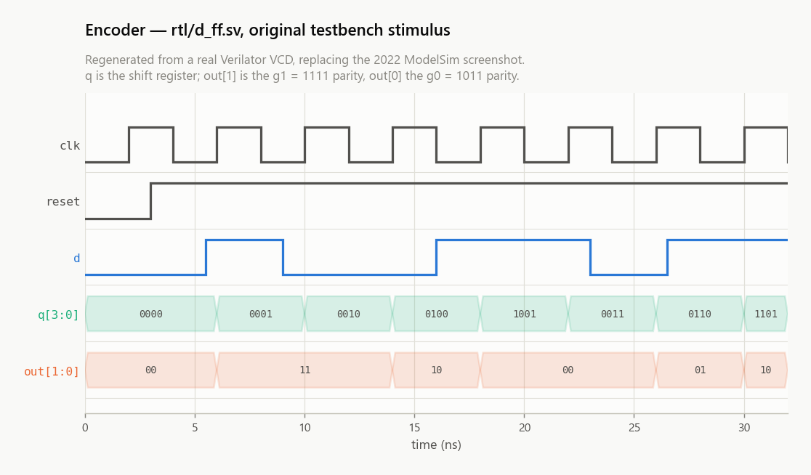
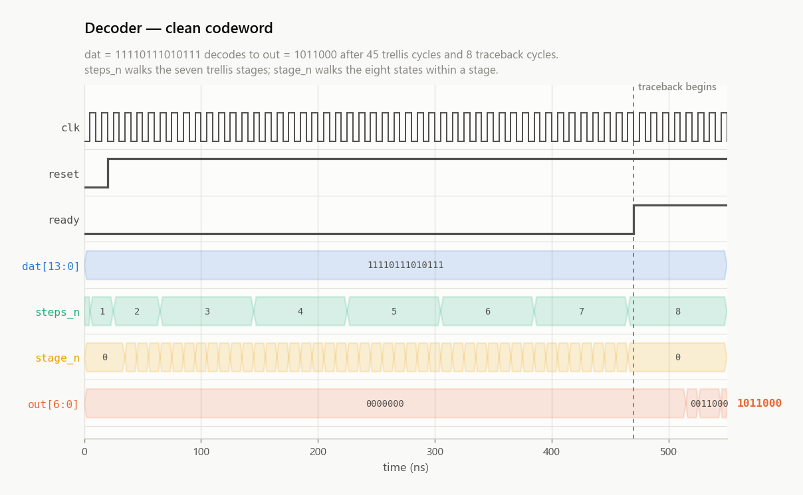
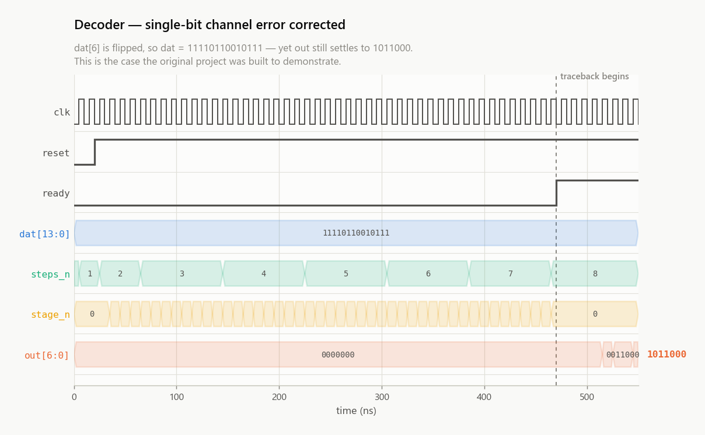
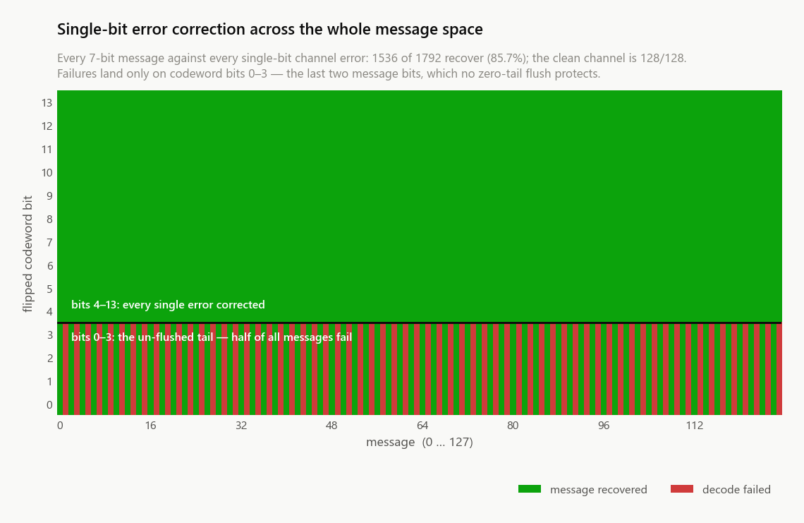
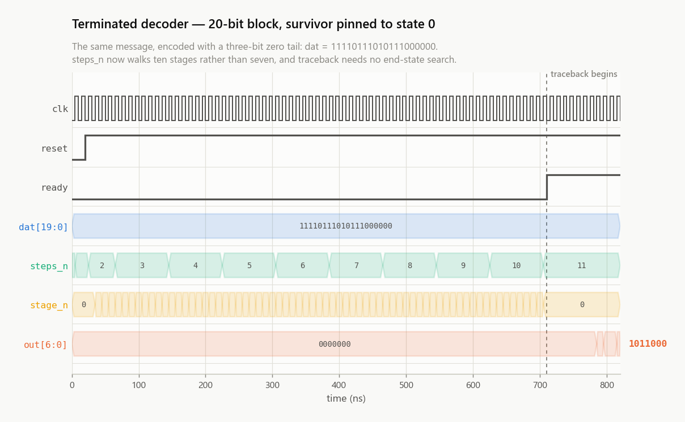
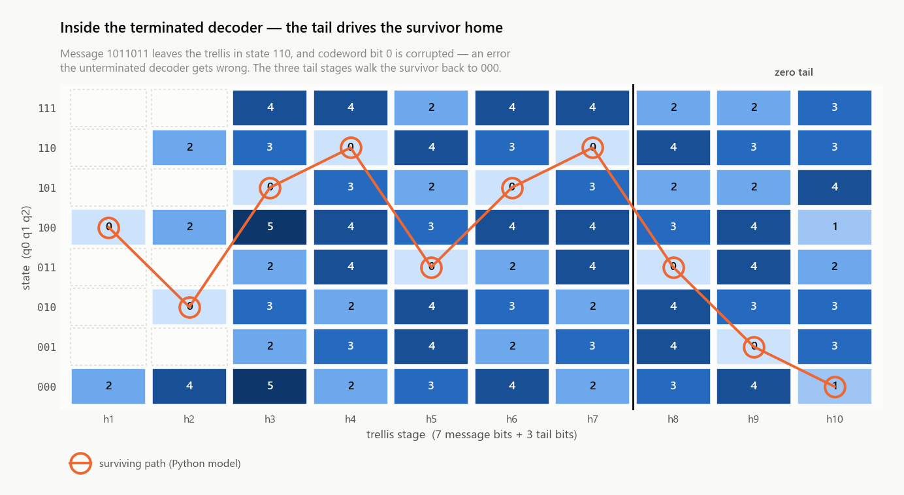
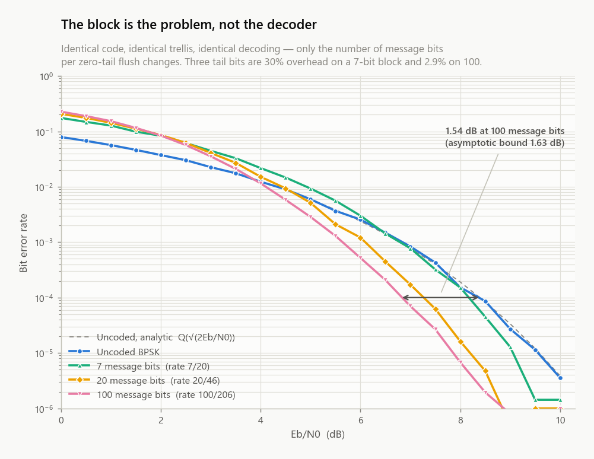
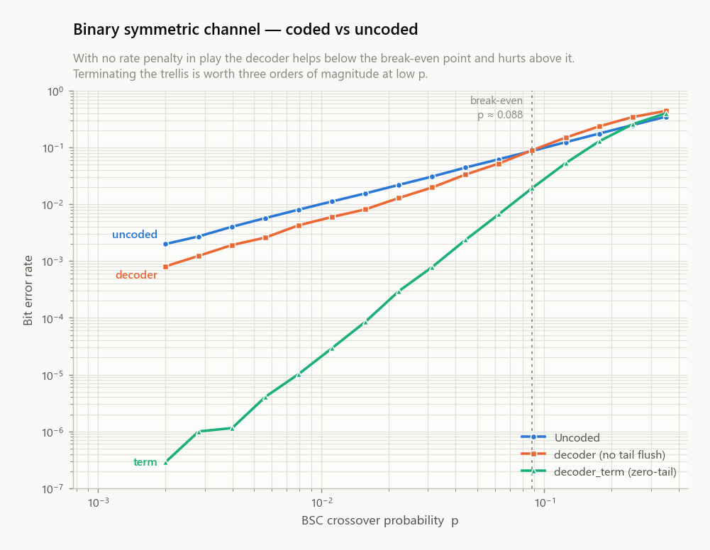

# Architecture

## The code

| Parameter | Value |
|---|---|
| Rate | 1/2 |
| Constraint length K | 4 |
| Memory elements | 3 |
| Trellis states | 8 |
| Generators | g1 = `1111` (octal 17), g0 = `1011` (octal 13) |
| Decision | hard |

Three decoders are built. The first two differ only in block framing — the
code, the generators and the encoder are identical. The third decodes the same
trellis as the second and returns the same bits, but is built differently:

| | `rtl/decoder.sv` | `rtl/decoder_term.sv` | `rtl/decoder_folded.sv` |
|---|---|---|---|
| Message block | 7 bits | 7 bits + 3 zero tail bits | parameter, default 7 + 3 |
| Codeword | 14 bits | 20 bits | 2 × (MSG_BITS + 3) |
| Effective rate | 7/14 = 0.50 | 7/20 = 0.35 | 0.35 → 0.5 as the block grows |
| Trellis stages | 7 | 10 | MSG_BITS + 3 |
| Traceback starts from | lowest of 8 end states | state 0, known | state 0, known |
| Latency | 45 + 8 clocks | 69 + 11 clocks | 10 + 10 clocks |
| Single-bit errors corrected | 1536/1792 (85.7%) | **2560/2560 (100%)** | **2560/2560 (100%)** |
| Architecture | unrolled, serial | unrolled, serial | folded |

`decoder.sv` is what the original assignment produced and what the published
waveforms show. `decoder_term.sv` is what the code should have been framed as.
`decoder_folded.sv` is what the hardware should have been structured as — see
[Translating a C++ model into hardware](#translating-a-c-model-into-hardware).

### Where the 7-bit block came from

It was never chosen. The assignment asks for the bit sequence `1011`, and the
canonical message throughout this repo is `1011000` — `1011` with three zeros
appended, three being exactly K-1.

So the original block was *accidentally zero-tail terminated*. The encoder was
already being flushed back to state 0; those three zeros carry no information
and exist only to drive the shift register home. What the original decoder did
not do was use that: it treated all seven bits as message and searched all
eight end states for the best final metric, rather than starting traceback from
the state it had itself guaranteed.

That is the whole of the 2.3 dB that `decoder_term` recovers. The information
was already in the codeword and was being thrown away.

## Encoder — `rtl/d_ff.sv`

A four-tap shift register. On each rising edge `q0 <- d`, `q1 <- q0`,
`q2 <- q1`, `q3 <- q2`, and the outputs are then computed from the *post-shift*
register:

```
out[1] = q0 ^ q1 ^ q2 ^ q3      // g1 = 1111
out[0] = q0 ^ q1 ^ q3           // g0 = 1011
```

Writing the pre-shift state as `s = (q0, q1, q2)` with `s2 = q0` the newest bit,
that is equivalently

```
out1 = d ^ s2 ^ s1 ^ s0
out0 = d ^ s2 ^ s0
next = (d << 2) | (s >> 1)
```

so state `n` is reachable only from `2*(n & 3)` and `2*(n & 3) + 1`. This is
the transition rule the decoder, the Python model and every figure share.

The encoder running the canonical message, taken from a real Verilator VCD
rather than a screenshot — `d` shifting through `q`, and the two parities
appearing on the post-shift register:

<p align="center">
  <picture>
    <source media="(prefers-color-scheme: dark)" srcset="img/encoder_waveform-dark.png">
    
  </picture>
</p>

## Decoder

The decoder takes the entire received word in parallel on `dat` and returns the
7-bit message on `out`. It is a single `always @(posedge clk)` block with the
trellis fully unrolled — one `steps_n`/`stage_n` branch per butterfly.

**Both variants are generated** from `rtl/gen/decoder.sv.j2` by
`scripts/gen_rtl.py`. The original was written out by hand, which is why it ran
to 1317 lines for seven stages; extending that to ten by hand would have meant
~600 more lines of near-identical ladder with a mistyped `high`/`low` waiting in
it. The template derives every branch's expected output pair from the generator
polynomials instead, so the two variants cannot disagree by transcription error.
The generated seven-stage decoder is checked against the golden model on the
same 1920 cases as the hand-written one, which is what shows the template
reproduces the original rather than merely resembling it.

Do not edit `rtl/decoder.sv` or `rtl/decoder_term.sv` directly — edit the
template and run `python scripts/run_all.py gen`. `gen --check` fails if the
checked-in files have drifted.

**Data structures.** One `HammingTable` struct per trellis stage, `h1 … h7`
(or `h1 … h10`). Each holds the received bit pair for its stage, the eight branch metrics
(`aTransition … hTransition`), the previous stage's metrics, and its own eight
accumulated path metrics in `hammingDistances.finalStates[0:7]`. These are
*unpacked* structs containing unpacked arrays — the single most consequential
fact about this design for tooling (see [toolchain.md](toolchain.md)).

**Schedule.** One add-compare-select butterfly per clock edge, sequenced by
`steps_n` (which stage) and `stage_n` (which state within the stage):

| `steps_n` | edges | why |
|---|---|---|
| 1 | 1 | only state 0 is occupied, so only two branches exist |
| 2 | 4 | four states reachable (0, 2, 4, 6) |
| 3 … N | 8 each | the full trellis |
| **total** | **45** (7 stages) / **69** (10 stages) | |

Traceback then needs one edge to establish the starting state and one per stage
to walk back and emit the message: **53 clocks end to end** unterminated, **80**
terminated. In the terminated variant the first three bits recovered are the
zero tail and are dropped rather than driven onto `out`.

The schedule as it actually runs — a clean codeword, then the same codeword
with one bit flipped. `out` settles to the same message in both:

<p align="center">
  <picture>
    <source media="(prefers-color-scheme: dark)" srcset="img/decoder_waveform_clean-dark.png">
    
  </picture>
  <br><br>
  <picture>
    <source media="(prefers-color-scheme: dark)" srcset="img/decoder_waveform_error-dark.png">
    
  </picture>
</p>

Because `$dumpvars(0, ...)` reaches the whole hierarchy, the per-stage metrics
are in the VCD too. Below is `h1..h7.hammingDistances.finalStates[0:7]` — the
path metric of every state at every trellis stage, read straight out of the
RTL, with the surviving path from the Python model overlaid:

<p align="center">
  <picture>
    <source media="(prefers-color-scheme: dark)" srcset="img/decoder_metrics-dark.png">
    
  </picture>
</p>

**Survivor marking.** Rather than storing survivor pointers, the loser of each
compare has its branch-metric field overwritten with the sentinel value `3`.
`getReturnPath()` later reads those sentinels back to reconstruct the path. The
C++ reference uses `-1` for the same purpose.

**Comparisons** use a strict `<`, so on a metric tie the *higher-numbered*
predecessor survives; the final-state scan also uses strict `<`, so on a tie the
*lowest-numbered* state wins.

That tie rule is worth stating carefully, because **two of the four
implementations here had it backwards** — including `model/viterbi_ref.py`,
the golden model everything else is checked against, and the C++ reference.
Nothing caught it, because a single bit error never produces a tie: the two
possible rules agree on all 4608 exhaustive single-error cases, which is every
case any sweep here ran. Ties appear from three errors up, where the rule
changes 11% of decodes. It was settled by simulating four three-error words
through `rtl/decoder_term.sv`, and those words are now pinned as regressions in
both models. See [known-issues.md #6](known-issues.md).

## Why the unterminated design loses to uncoded BPSK

The 7-bit block is not flushed with `K-1 = 3` zero bits, so the decoder cannot
force the trellis back to state 0 and must instead minimise over all eight end
states. The last two message bits are therefore decided by only one or two
branch comparisons each, and are barely protected.

Consequences, all measured rather than asserted:

* Exhaustively, 1536 of 1792 single-bit channel errors are corrected (85.7%),
  and **every** failure lands on codeword bits 0-3.
* Over AWGN the rate-1/2 code spends 3 dB of energy per information bit to buy
  redundancy, and the weak tail means it never earns that back: the as-built
  decoder sits *above* the uncoded BPSK curve at every Eb/N0 simulated.

The first of those is worth seeing rather than reading — 128 messages down
against 14 error positions across, one cell per decode. The failures are four
clean vertical bands, not scatter:

<p align="center">
  <picture>
    <source media="(prefers-color-scheme: dark)" srcset="img/error_correction_heatmap-dark.png">
    
  </picture>
</p>

This is a property of the block framing, not a bug in the ACS or traceback
logic - those are exactly correct, as the 1920-case equivalence check shows.

## What termination fixes

`rtl/decoder_term.sv` clocks `K-1 = 3` zeros in after the message, driving the
encoder's register back to state 0. The decoder then knows where the survivor
ends and traces back from there unconditionally.

This does not change the code. It is still (2,1,4), still rate 1/2, still the
same generator polynomials, and `rtl/d_ff.sv` is byte-identical between the two
flows - terminating is something the *transmitter* does, not the encoder. Only
the framing changes: 7 message bits now occupy 20 code bits instead of 14, an
effective rate of 0.35 rather than 0.50.

What it buys:

* **2560/2560** single-bit errors corrected, at every one of the 20 codeword
  positions, across all 128 messages. `docs/img/error_correction_compare.png`
  puts the two side by side.
* About **2.3 dB at BER = 1e-3** over AWGN *relative to `decoder`*.

The terminated decoder running: twenty received bits, ten trellis stages, and
no end-state search at all.

<p align="center">
  <picture>
    <source media="(prefers-color-scheme: dark)" srcset="img/decoder_term_waveform-dark.png">
    
  </picture>
</p>

<p align="center">
  <picture>
    <source media="(prefers-color-scheme: dark)" srcset="img/decoder_term_metrics-dark.png">
    
  </picture>
</p>

That second figure is the clearest picture of what termination does. Message
`1011011` leaves the trellis in state `110`, and codeword bit 0 is corrupted —
an error the unterminated decoder gets wrong. The three tail stages walk the
survivor back down to `000`, which is why traceback can start there without
searching.

## How much coding gain is actually available here

The free distance of this code is worth computing rather than quoting. Taking
the minimum Hamming weight over all paths that leave state 0 and remerge:

    d_free = 6

For hard-decision Viterbi the asymptotic coding gain over uncoded BPSK is

    G_hard = 10 log10(R * d_free / 2)
    G_soft = 10 log10(R * d_free)

and R here is the *effective* rate, which the tail makes much worse than 1/2.
The tail is K-1 = 3 bits however long the block is, so it is pure framing
overhead that amortises away as the block grows. The last column is no longer a
formula: `model/ber_sweep.py` now simulates the long blocks alongside the short
one, at the same Eb/N0 points on the same curve.

| block | rate | tail overhead | G_hard (asymptotic) | measured at BER = 1e-4 |
|---|---|---|---|---|
| 7 message bits + 3 tail | 7/20 = 0.350 | 30% | **+0.21 dB** | +0.20 dB |
| 20 + 3 | 20/46 = 0.435 | 13% | +1.15 dB | +1.10 dB |
| 100 + 3 | 100/206 = 0.485 | 2.9% | +1.63 dB | +1.54 dB |
| asymptotic (R -> 1/2) | 0.500 | - | +1.76 dB | - |

The measured column sits just under the asymptotic one and closes on it as the
BER drops, which is what the bound predicts — at BER = 1e-5 the 100-bit block
measures +1.70 dB against a bound of +1.63.

<p align="center">
  <picture>
    <source media="(prefers-color-scheme: dark)" srcset="img/ber_blocklen-dark.png">
    
  </picture>
</p>

Two things follow. First, termination is necessary but not sufficient — it
fixes the unprotected tail bits and stops the design losing badly, but on a
7-bit block it cannot deliver much gain, because three flush bits on seven
message bits is 30% overhead. The fix is a longer block, and the *algorithm*
genuinely does not care: same generators, same 8 states, same
add-compare-select, only more stages.

The *implementation* cared a great deal, and an earlier version of this
document was wrong about that. It claimed the block length was already a
parameter because the RTL is generated from a template. Three widths in that
template were hard-coded for a 7-bit block, and past them the decoder returned
garbage without a warning — at 20 message bits it decoded 3/200 frames
correctly. Those are fixed ([known-issues.md #7](known-issues.md)), but the
deeper problem was architectural and has its own section below.

Second, the largest single improvement still available is soft decision:
G_soft = 10 log10(0.35 * 6) = +3.2 dB, versus +0.21 dB hard. That is a decoder
change, not a framing change, and the RTL is hard-decision only.

### On a channel with no rate penalty

All of the above is about AWGN, where the rate penalty is what makes the short
block lose. On a binary symmetric channel the comparison is against raw
crossover probability and no energy is spent on redundancy, so the picture is
friendlier: the decoder helps below p ≈ 0.088 even unterminated.

<p align="center">
  <picture>
    <source media="(prefers-color-scheme: dark)" srcset="img/ber_bsc-dark.png">
    
  </picture>
</p>

This is not a kinder way of stating the AWGN result — it is a different
question. The BSC curve answers "given a fixed bit-flip probability, does
decoding help", and the AWGN curve answers "given a fixed energy budget, does
spending some of it on redundancy help". A real link poses the second.

## Translating a C++ model into hardware

This is the most useful thing in the repo to read, because the mistake in it is
the ordinary one and it is invisible from inside the code.

The model came first and the RTL was written by porting it structure for
structure. As `model/cpp/viterbi_2_1_4.cpp:3-5` records, that model was
originally "a single hardcoded decode of one canonical word, with the trellis
stages h1..h7 written out by hand in main()". Each stage was a `HammingTable`
object; `computeHammingDistance()` walked its eight states through a
`switch` with one case per predecessor letter, `a` through `h`.

Transliterated, each of those became the wrong kind of thing:

| in the C++ | became in the RTL | cost |
|---|---|---|
| one `HammingTable` object per stage | `HammingTable h1, h2, … h10` | ~350 LUT4 per stage — an *object* became a *register bank* |
| calling `computeHammingDistance()` per stage | the `steps_n` sequencer | one clock per sub-step |
| the `switch` over cases `a … h` inside it | the `stage_n` sequencer | ~8 clocks per stage |

The object graph became silicon and the control flow became clock cycles. Both
translations are individually defensible; taken together they are the worst
possible pair, because **in hardware a repeated computation decomposes into
time and space and you must spend one to save the other**. Unrolling is a real
choice: unrolled, a trellis can be pipelined to retire a stage every clock,
buying throughput with area. Serialising is equally real: one add-compare-select
unit reused, minimum area. This design does neither — it pays the area of the
unrolled version *and* the clock count of the serial one, and is strictly worse
than both on both axes at once.

The documentation error above has the same root. That C++ file was later
refactored so its stages are built in a loop over a `vector<HammingTable>`
(`viterbi_2_1_4.cpp:453-465`), and its header now says "stages are built in a
loop rather than unrolled, so the block length is a parameter". True — of the
C++.

And that is exactly the trap. In software, going from hand-unrolled stages to a
loop is a free refactor: you write the loop and the block length becomes a
parameter. In hardware it is not a refactor at all. It is a different
architecture, which is what the rest of this section is about. The C++ got the
improvement for nothing; the RTL never got it; and the claim migrated from one
to the other because they were described as the same design.

### What it should have been — `rtl/decoder_folded.sv`

The standard architecture, and what every production Viterbi decoder uses, is
*folded*: one set of add-compare-select units reused every stage. Here all 8
butterflies evaluate in parallel and one trellis stage retires per clock. The
per-stage objects become *one* register bank read and rewritten every cycle,
and the control flow that had become a sequencer becomes plain combinational
logic — the two translations above, both made the other way.

Two details make it work at any block length. Path metrics are renormalised by
subtracting the stage minimum, which cannot change any later comparison but
bounds the width: measured over the model at 200 stages and channel error rates
from 0.05 to 0.5, the spread across the 8 states never exceeds 5, so **4 bits
is enough forever**. And survivor decisions go to memory — one byte per stage —
rather than into replicated logic.

It decodes the identical trellis. `scripts/check_rtl.py` holds it to the same
2688 exhaustive cases as `decoder_term`, plus 512 random three-error words
where the tie rule is actually observable, and it agrees with the golden model
on all 3200.

That is at 7 message bits, which is the length at which the metric
normalisation does the least work. `scripts/check_folded.py` carries the check
out to 20, 40 and 100 message bits through `tb/decoder_folded_gen_tb.sv` — the
same RTL, only the `MSG_BITS` parameter moves, because the folded decoder has
no per-stage code to re-render the way `rtl/gen/decoder.sv.j2` does. It agrees
with `model/viterbi_ref.decode_terminated` on every frame at all three lengths,
which is what makes the 4-bit metric bound an observation rather than an
argument.

| at 7 message bits / 10 stages | `decoder_term` (unrolled) | `decoder_folded` |
|---|---|---|
| logic cells | 2356 / 5280 (44%) | **627 / 5280 (11%)** |
| LUT4 / carry / flops | 1936 / 799 / 703 | 421 / 142 / 210 |
| trellis + traceback clocks | 69 + 11 = 80 | 10 + 10 = **20** |
| Fmax | 27.1 MHz | 11.3 MHz |
| throughput (7-bit block) | 2.37 Mbit/s | **3.95 Mbit/s** |

3.8× smaller and 1.7× faster in throughput, despite a clock less than half the
speed — because it needs a quarter of the clocks. The lower Fmax is real and is
this implementation's own weak point: the whole stage, eight butterflies plus
the minimum-search and the normalising subtract, sits in one combinational
path. Splitting the normalisation across a pipeline register, or using modulo
arithmetic instead, would shorten it. That is the obvious next improvement.

The point of the architecture, though, is the scaling:

<p align="center">
  <picture>
    <source media="(prefers-color-scheme: dark)" srcset="img/area_blocklen-dark.png">
    
  </picture>
</p>

| message bits | unrolled LUT4 | folded LUT4 |
|---|---|---|
| 7 | 1936 | 421 |
| 20 | 6098 — over device | 622 |
| 40 | 13565 — over device | 983 |
| 100 | — | 1823 |

The unrolled decoder costs ~350 LUT4 per trellis stage and runs out of an iCE40
UP5K at about **17 message bits**. The folded one costs ~15, and what remains is
the survivor memory and the parallel input register — both memory rather than
logic, and a streaming sliding-window traceback would bound even those, which is
how a real decoder handles an unbounded stream in constant area.

This is the answer to "how do cellular modems fit a Viterbi decoder alongside
everything else". Not lithography, though modern process nodes obviously help:
their decoders are **constant-area in block length**, and a decoder that never
grows with the message can run on a stream that never ends. Scaling the numbers
above, the classic GSM/UMTS K=7 (133,171) code has 64 states rather than 8, so
roughly eight times the add-compare-select logic — order 3–4k LUT4 folded,
which this small FPGA could still host. Unrolled, it would not fit anything.

## Synthesis and critical path

On an iCE40 UP5K (SG48), via Yosys `read_slang` and nextpnr-ice40:

| | logic cells | LUT4 | carry | flops | Fmax | critical path |
|---|---|---|---|---|---|---|
| `decoder` | 1810 / 5280 (34%) | 1338 | 511 | 497 | ~13 MHz | 77.7 ns (33.4 logic + 44.3 routing) |
| `decoder_term` | 2356 / 5280 (44%) | 1936 | 799 | 703 | ~27 MHz | 36.9 ns (12.7 logic + 24.2 routing) |
| `decoder_folded` | 627 / 5280 (11%) | 421 | 142 | 210 | ~11 MHz | 88.7 ns |

Two things in the first two rows are worth reading carefully.

The terminated decoder is 30% larger, which is expected - three more trellis
stages means three more `HammingTable` structs and three more ladder blocks.

It is also **twice as fast**, and the timing report says why. In both variants
the critical path starts at `data`, runs through a stage's add-compare-select
carry chains, and ends at the `lowest_index` register - that is, it ends in the
eight-way minimum-over-end-states search. Because the whole decoder is one
`always` block using blocking assignments, that search is chained
combinationally onto metrics computed earlier in the *same* clock edge.

`decoder_term` does not have the search: a terminated trellis knows the survivor
ends in state 0, so `lowest_index` is simply assigned 0. That takes the path
from 60 hops to 14.

So the ceiling is the end-state search, not the traceback tree - an earlier
version of these notes said `getReturnPath()` and was wrong. The fix for the
unterminated decoder is to register the search rather than fold it into the same
edge, at the cost of one clock of latency. Fmax varies by roughly ±0.5 MHz
between placer seeds, so treat the table as approximate.

`decoder_folded` has the lowest Fmax of the three and it is the only one of
these numbers that flatters nobody: it does a whole trellis stage per clock, so
eight butterflies, the eight-way minimum and the normalising subtract are all
in one combinational path. It still wins on throughput — 20 clocks against 80
for the same block — but the clock itself is the thing to fix next, by
pipelining the normalisation or replacing it with modulo arithmetic. Reading
the table as "folded is slower" would be backwards; reading it as "folded has
an unpipelined critical path" is the right conclusion.

See also [bitorder.md](bitorder.md), [known-issues.md](known-issues.md),
[toolchain.md](toolchain.md).
